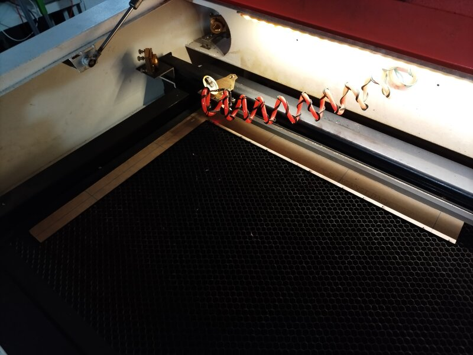

* Problem to solve: skewed bed borders

* Solution: laser cut own frame, then position objects against it

Steps:

 1. Test settings for cutting and for vector engraving using
    `test.dxf`.

 2. Place a sufficiently big piece of material on the laser bed, and
    make sure it aligns with the top of the bed.

 3. Laser cut and engrave the big piece.

For use, place the piece back in the same position in which it was
cut.
