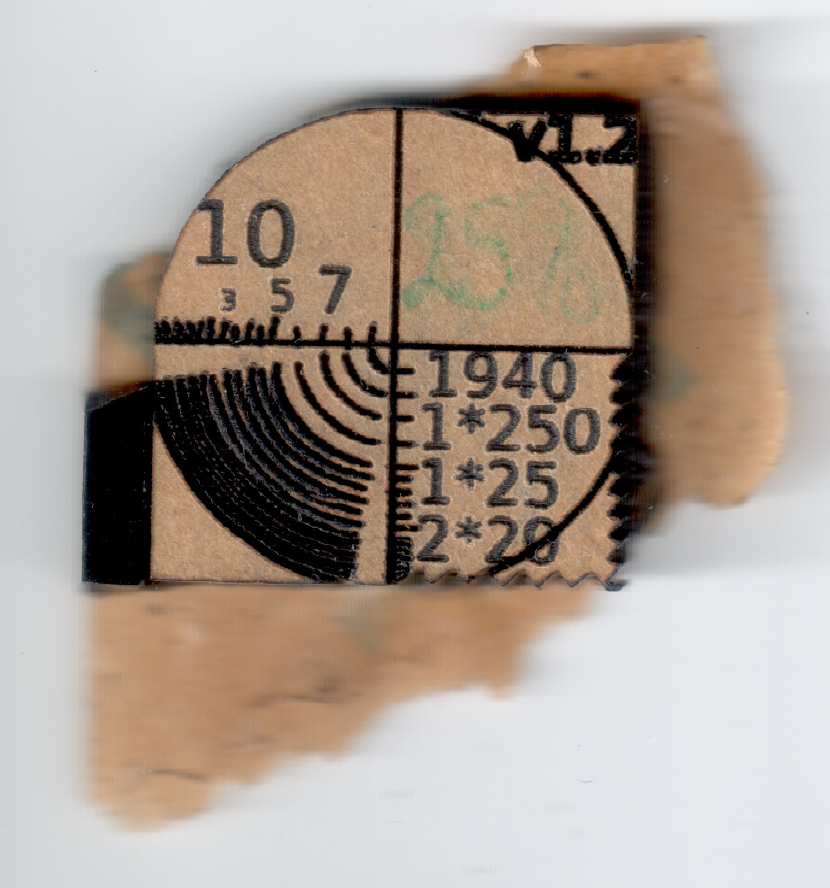
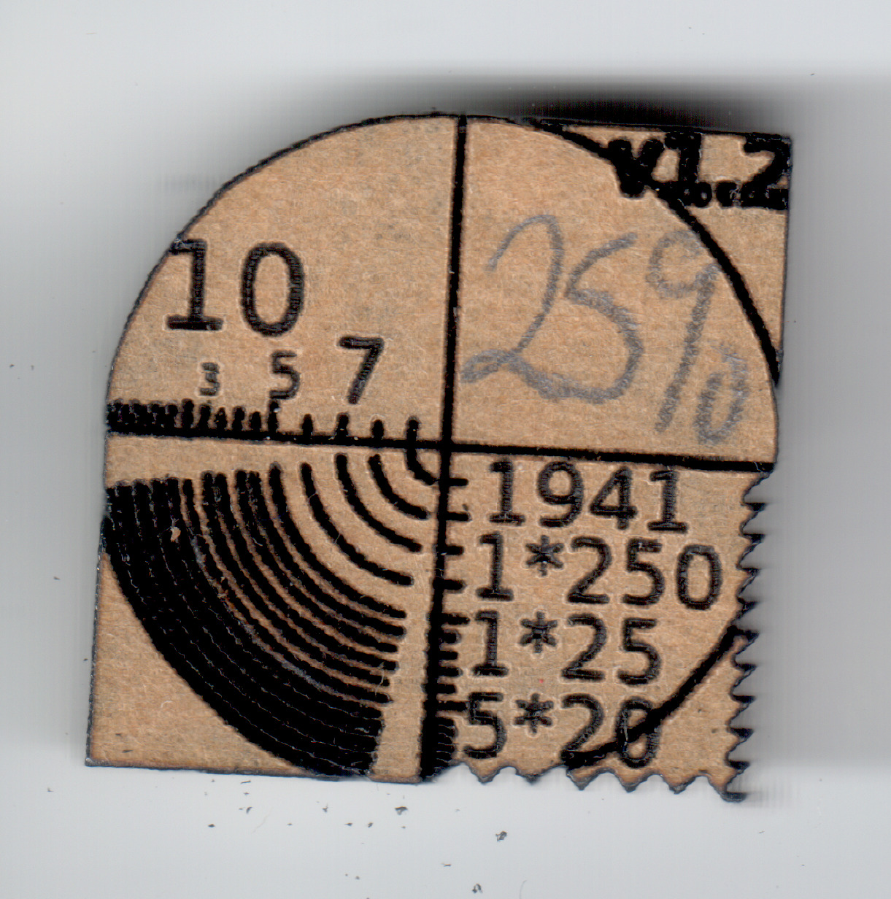
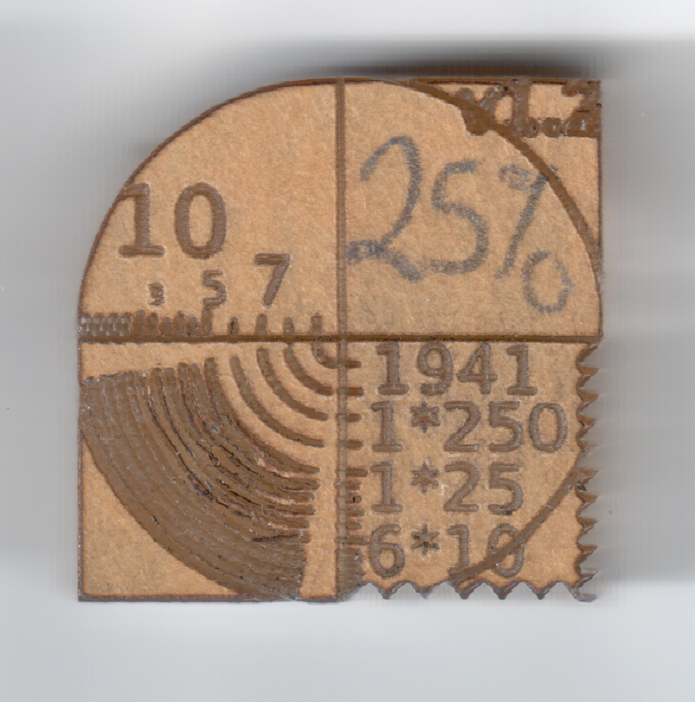
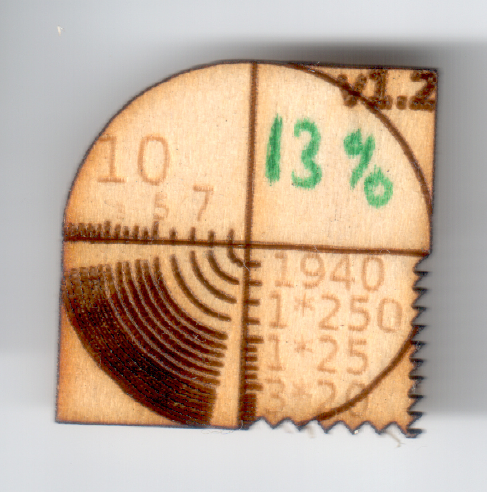
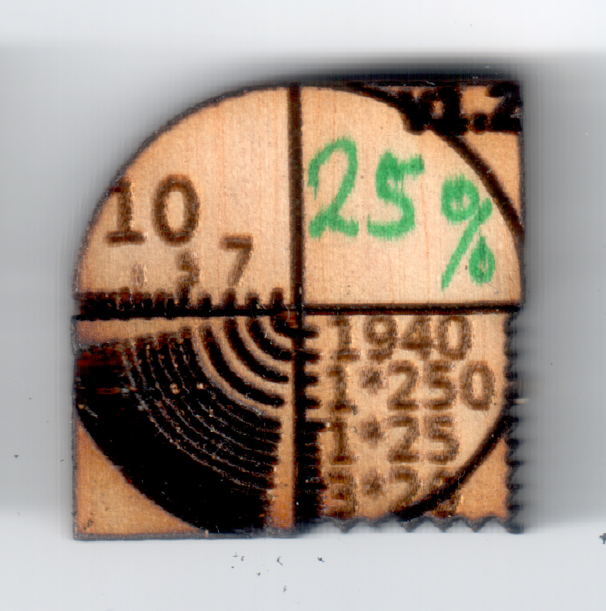
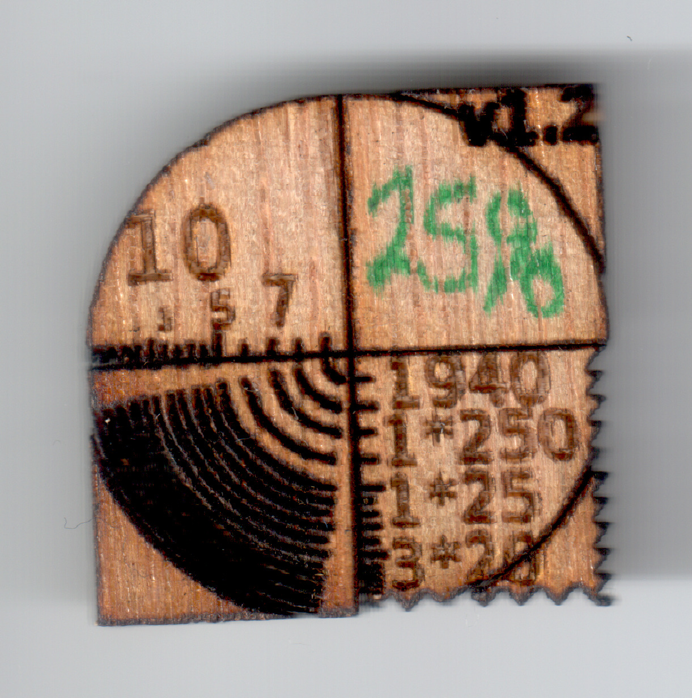

Occasionally, we do test cuts to check how the laser works on various
materials.  It can also be used to watch out for degradation in the laser
power (as the tube gets older, the power output drops)

To ensure consistancy, tests are done with a specific
[sample diagram](test.svg).  This diagram is specially marked up to interface
with our [patched k40_whisperer](https://github.com/dimsumlabs/k40_whisperer).
After setting the repeats and speed for a test in k40_whisperer, reload the
drawing and the output lasercut will be automatically updated to show the
exact settings that were used (along with the YYMM Date code of the test)

* *Thic* is how thick the material is (in millimeters)
* *Date* is the YYWW that the test was done
* *Pwr* is the Laser percentage power (kept the same for all three passes)
* *Rast* is the repeat count and mm/second speed for the Raster drawing pass
* *Vect* is the repeat count and mm/second speed for the Vector drawing pass
* *Cut* is the repeat count and mm/second speed for the Cut pass

| Material | Thic | Date | Pwr | Rast | Vect | Cut | Remarks | Image |
| -------- | ---- | ---- | ----- | ------ | ------ | --- | ------- | ----- |
| Dark plastic | 3 | 1940 | 25% | 1x250 | 1x25 | 2x20 | Could be broken out of surround, but significant plastic adhering |  |
| Dark plastic | 3 | 1940 | 25% | 1x250 | 1x25 | 3x20 | |  |
| Dark plastic | 3 | 1941 | 25% | 1x250 | 1x25 | 5x20 | |  |
| Clear plastic | 6 | 1941 | 25% | 1x250 | 1x25 | 6x10 | not quite cut through |  |
| Balsawood? | 2 | 1940 | 13% | 1x250 | 1x25 | 3x20 | |  |
| Balsawood? | 5 | 1940 | 25% | 1x250 | 1x25 | 3x20 | Some scorching seen |  |
| White top, epoxy infused wood | 3 | 1940 | 25% | 1x250 | 1x25 | 3x20 | Some discoloration of the white top |  |
| ? | 2.5 | 1940 | 25% | 1x250 | 1x25 | 3x20 | Raster Cross almost cut through |  |
